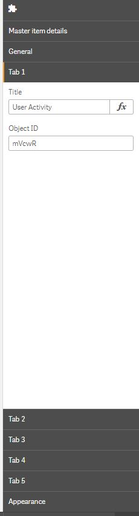

## Qlik Sense Extension Tabbed Container
The Tabbed Container is a Qlik Extension that groups Sense objects in a container and displays tabs as a way of navigating through them.

It takes a maximum of 5 pairs (title, objectId) as the input that is used to display the visualization. The tab displays the text within the "title" input and the body of the container displays the object with the corresponding ID.

Additionally, the style of the body and the tabs may be easily modified through the options given in the "Appearance" section through the following options:+

1. Border color-picker: it sets the color of the border of the body container through a standard Qlik Sense color picker.
2. Background color-picker: it sets the color of the background of the body container through either a standard Qlik Sense color picker or an input box that takes any valid way of expressing color (RGB, HEX, etc.).
3. Button color-picker: it sets the color of the border and of the background of the tab that is active.
4. Additional settings:
    1. Collapse when there is 1 tab: when set to true, the tabs are hidden if there is only one object.

In the event that the width assigned to the extension is lower than the space needed to render the tabs, the Tabbed Container will go into stacked mode. This is bound to happen as well in mobile devices.

## How to use
1. Copy the extension folder into your Qlik/Sense/Extensions folder.
2. Set the values for the `(title,objectId)` you wish to display.
3. The changes should appear automatically the extension.

## Contributing

1. Fork it!
2. Create your feature branch: `git checkout -b my-new-feature`
3. Commit your changes: `git commit -am 'Add some feature'`
4. Push to the branch: `git push origin my-new-feature`
5. Submit a pull request :D

## License

Copyright © 2017 Analytics Operations

Released under the MIT license.

***
