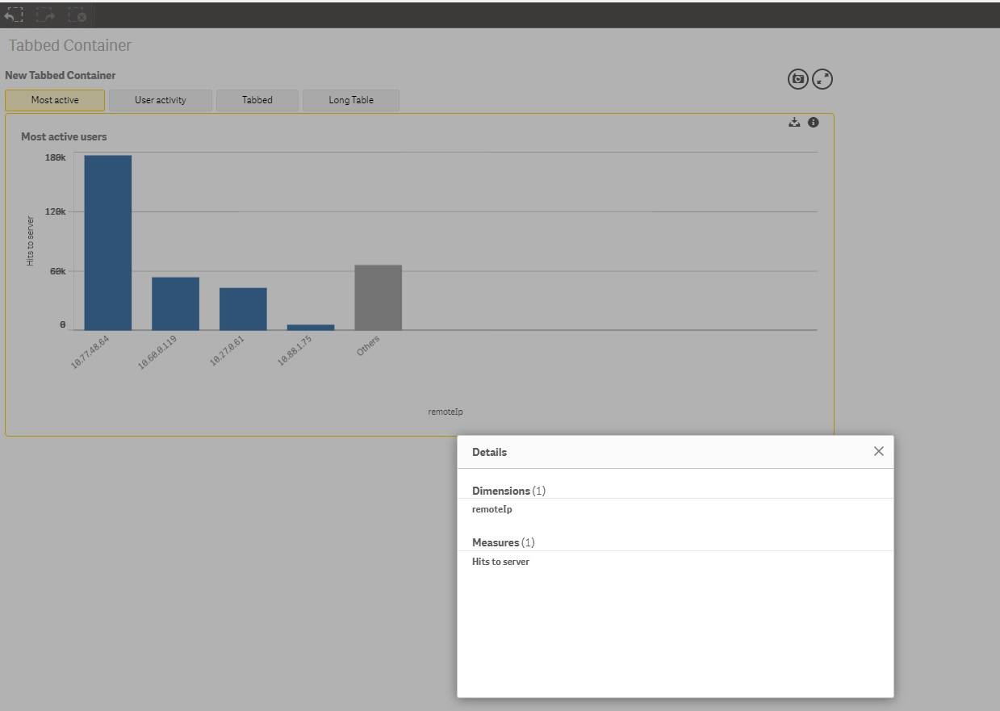

## Qlik Sense Extension Tabbed Container
The Tabbed Container is a Qlik Extension that groups Sense objects in a container and displays tabs as a way of navigating through them.

### Adding tabs
The extension can display a maximum of 5 tabs, having each tab its own title -which is displayed in the navigation button- and its own visualization.
In order to add one of your visualizations to a given tab, go into edit mode and select the tab to which you want to add the visualization. Then, you can select a preexisting  visualization using either one of the following methods:

1. Select a visualization from your master items library using the dropdown.
2. Enter the objectId of any visualization within the app.

In the event that both parameters are given, the extension will take the input from the objectId field.

### Export the data
The data displayed in the current visualization can be exported to CSV by clicking on the export button, which can be found in the upper right corner of the object container.

It is to be noted that currently, this feature does not work on the Desktop version of Qlik Sense.

### View the object details
The details of the active chart can be viewed normally, just like in the native Sense objects. To do so, you'll need to activate this option from the properties panel, in the Appearance section by switching off the option *"Hide the details button"*, which is turned on by default.

Once you activate this option, you'll see a information icon in the upper right corner of the container, provided that the visualization has a *qHyperCube*. You may see the details of the visualization by clicking on this icon.

### Styling options
The style of the body and the tabs may be easily modified through the options given in the "Appearance" section through the following options:

1. Border color-picker: it sets the color of the border of the body container through a standard Qlik Sense color picker.
2. Background color-picker: it sets the color of the background of the body container through either a standard Qlik Sense color picker or an input box that takes any valid way of expressing color (RGB, HEX, etc.).
3. Button color-picker: it sets the color of the border and of the background of the tab that is active.
4. Additional settings:
    1. Collapse when there is 1 tab: when set to true, the tabs are hidden if there is only one object.
    2. Hide the export button.
    3. Hide the details button.

In the event that the width assigned to the extension is lower than the space needed to render the tabs, the Tabbed Container will go into stacked mode. This is bound to happen as well in mobile devices.

## How to use
1. Copy the extension folder into your Qlik/Sense/Extensions folder.
2. Set the values for the `(title,objectId)` you wish to display.
3. The changes should appear automatically the extension.

## Contributing

1. Fork it!
2. Create your feature branch: `git checkout -b my-new-feature`
3. Commit your changes: `git commit -am 'Add some feature'`
4. Push to the branch: `git push origin my-new-feature`
5. Submit a pull request :D

## License

Copyright © 2017 Analytics Operations

Released under the MIT license.

***
